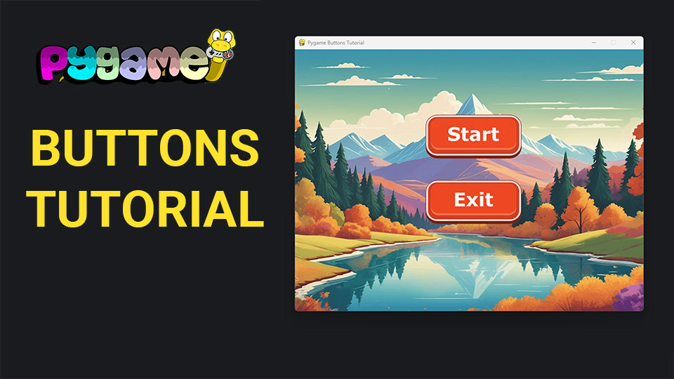

# Pygame Buttons Tutorial

This repository contains the code for a video tutorial on creating and using buttons in a Pygame project in Python.

## Video Tutorial

<p align="center">
  
</p>

<p align="center">
🎥 <a href="https://youtu.be/u35-y3OKj3o">Video Tutorial on YouTube</a>
</p>

## Overview

In this tutorial, we build a basic Pygame application that demonstrates how to create and use buttons. The tutorial covers setting up the Pygame window, creating button objects, detecting button presses, and handling button events.

## Features

- **Pygame Window Setup:** Initialize a Pygame window with a specified width and height.
- **Buttons:** Create and display interactive buttons that respond to user inputs.
- **Event Handling:** Detect button presses and perform actions based on those events.
- **Visual Feedback:** Visual representation of buttons and their states.

## Code Structure

- **main.py:** The main script that initializes the Pygame window, handles events, checks for button presses, and renders the game objects.
- **button.py:** A separate module containing the `Button` class, which manages the button's image, position, scaling, drawing, and press detection.

## How to Run

1. Clone this repository:
   ```bash
   git clone https://github.com/educ8s/pygame-buttons-tutorial.git
   cd pygame-buttons-tutorial
   ```

2. Ensure you have Python and Pygame installed. You can install Pygame using pip:
   ```bash
   pip install pygame
   ```

3. Place your button images and background image in the `Graphics` directory.

4. Run the `main.py` script:
   ```bash
   python main.py
   ```

## Usage

- Run the script and a window titled "Pygame Buttons Tutorial" will appear.
- The start button and exit button will be displayed.
- Clicking the start button will print "Start Button pressed" to the console.
- Clicking the exit button will close the Pygame window and exit the program.

## Dependencies

- Python 3.x
- Pygame

## Contributing

Contributions are welcome! Please open an issue or submit a pull request if you have any suggestions or improvements.
